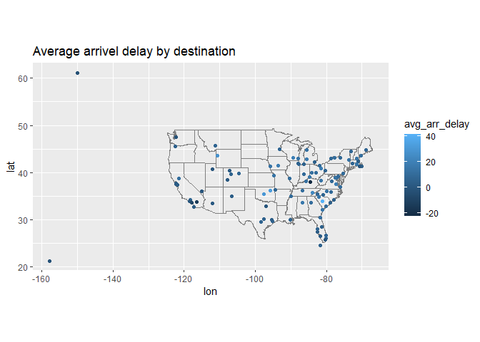
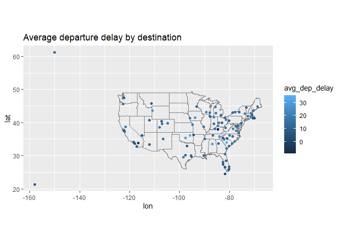
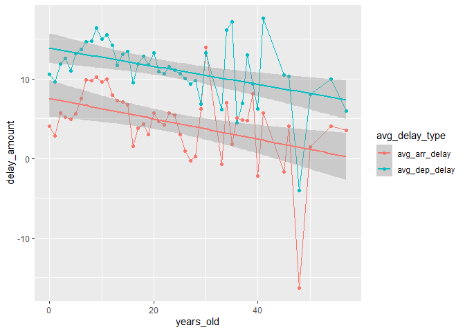

HW3
================
Nolan Wark
10/17/2022

github repo: [my github repo for homework 3 - Nolan
Wark](https://github.com/nwark/HW3_Nolan_Wark)

# Setup

``` r
library(nycflights13)
library(dplyr)
library(ggplot2)
library(tidyr)
```

``` r
#Data
# flights
# airlines
# airports
# planes
# unique(planes$year)
# weather
```

# Q1

``` r
temp = flights %>% 
  group_by(dest) %>% 
  summarise(avg_arr_delay = mean(arr_delay, na.rm = T),
            avg_dep_delay = mean(dep_delay, na.rm = T))

airports %>%
  inner_join(temp, c("faa" = "dest")) %>%
  ggplot(aes(lon, lat)) +
    borders("state") +
    geom_point(aes(color=avg_arr_delay)) +
    coord_quickmap() +
    ggtitle('Average arrivel delay by destination')
```

<!-- -->

``` r
airports %>%
  inner_join(temp, c("faa" = "dest")) %>%
  ggplot(aes(lon, lat)) +
    borders("state") +
    geom_point(aes(color=avg_dep_delay)) +
    coord_quickmap() +
    ggtitle('Average departure delay by destination')
```

<!-- -->

# Q2

``` r
flights %>% 
  left_join(select(airports, faa, lat, lon), by = c("origin" = "faa")) %>% 
  left_join(select(airports, faa, lat, lon), by = c("dest" = "faa"), suffix = c("_origin", "_dest")) %>% 
  select(origin, lat_origin, lon_origin, dest, lat_dest, lon_dest, everything())
```

    ## # A tibble: 336,776 x 23
    ##    origin lat_origin lon_origin dest  lat_dest lon_dest  year month   day
    ##    <chr>       <dbl>      <dbl> <chr>    <dbl>    <dbl> <int> <int> <int>
    ##  1 EWR          40.7      -74.2 IAH       30.0    -95.3  2013     1     1
    ##  2 LGA          40.8      -73.9 IAH       30.0    -95.3  2013     1     1
    ##  3 JFK          40.6      -73.8 MIA       25.8    -80.3  2013     1     1
    ##  4 JFK          40.6      -73.8 BQN       NA       NA    2013     1     1
    ##  5 LGA          40.8      -73.9 ATL       33.6    -84.4  2013     1     1
    ##  6 EWR          40.7      -74.2 ORD       42.0    -87.9  2013     1     1
    ##  7 EWR          40.7      -74.2 FLL       26.1    -80.2  2013     1     1
    ##  8 LGA          40.8      -73.9 IAD       38.9    -77.5  2013     1     1
    ##  9 JFK          40.6      -73.8 MCO       28.4    -81.3  2013     1     1
    ## 10 LGA          40.8      -73.9 ORD       42.0    -87.9  2013     1     1
    ## # ... with 336,766 more rows, and 14 more variables: dep_time <int>,
    ## #   sched_dep_time <int>, dep_delay <dbl>, arr_time <int>,
    ## #   sched_arr_time <int>, arr_delay <dbl>, carrier <chr>, flight <int>,
    ## #   tailnum <chr>, air_time <dbl>, distance <dbl>, hour <dbl>, minute <dbl>,
    ## #   time_hour <dttm>

# Q3

``` r
flights %>% 
  left_join(select(planes, year, tailnum), by = c("tailnum" = "tailnum"), suffix = c("_flight", "_man")) %>% 
  drop_na(year_man) %>% 
  group_by(year_man) %>% 
  summarise(avg_dep_delay = mean(dep_delay, na.rm = T),
            avg_arr_delay = mean(arr_delay, na.rm = T)) %>% 
  mutate(years_old = 2013 - year_man) %>% 
  pivot_longer(cols = c('avg_dep_delay', 'avg_arr_delay'), names_to = 'avg_delay_type', values_to = 'delay_amount') %>% 
  ggplot(aes(x=years_old, y=delay_amount, color=avg_delay_type)) +
    geom_line() +
    geom_point() +
    geom_smooth(method='lm')
```

    ## `geom_smooth()` using formula 'y ~ x'

<!-- -->

### There seems to be a slightly negative relation between the age of the plane and the average delay.
